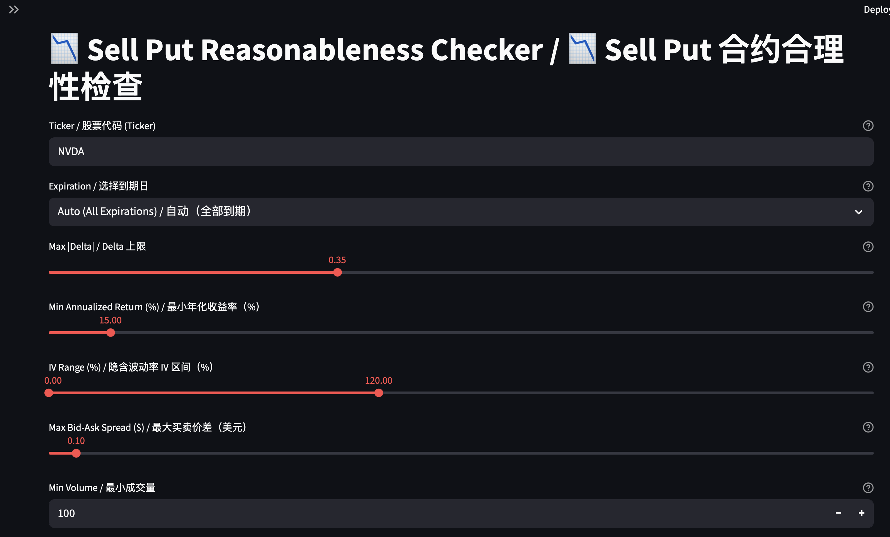
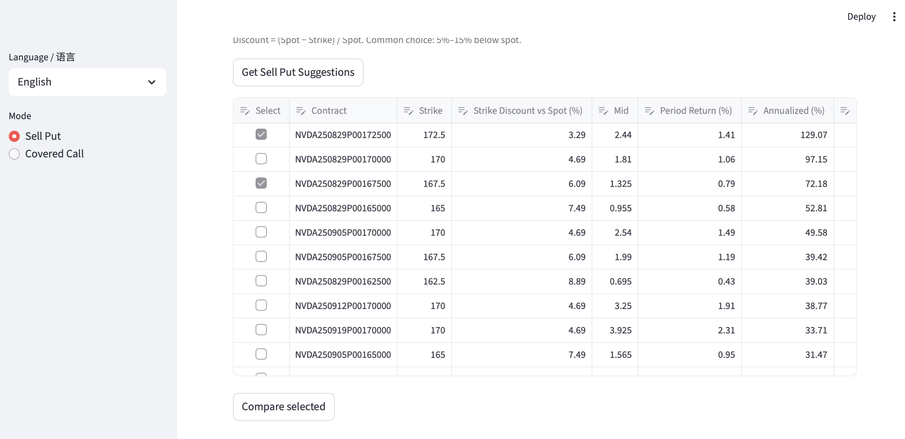

# 🚀 OptionStrategy Checker

An interactive tool for **Options Sellers** to analyze **Sell Put** and **Covered Call** strategies with automatic filters like IV, Delta, Bid/Ask Spread, Annualized Returns, and Strike Discount/Premium %.  
Stop manually calculating option greeks — let the checker show you **the best opportunities instantly**.  

一个专为**期权卖方**打造的交互式工具，用于分析 **卖出看跌 (Sell Put)** 和 **备兑开仓 (Covered Call)** 策略。

自动计算 **隐含波动率、Delta、买卖差价、年化收益率、行权价折价/溢价%**，帮你快速找到最优的期权机会！






## 🤔 Why Sell Put? 为什么要卖出看跌
- If you are bullish on a stock long-term but want to enter at a lower price, selling puts allows you to collect premium.
- If at expiration the stock stays above the strike → you keep the premium as pure profit.
- If at expiration the stock falls below the strike → you are obligated to buy, but your effective entry = strike - premium (discounted buy).
- So **Sell Put = Collect rent + Buy stock at discount**.
-
- 如果你看好某只股票的长期价值，但希望以更低的价格买入，可以通过卖出看跌获取权利金。
- 如果到期股价跌破行权价 → 你有义务买入股票，但实际买入价格 = 行权价 - 收到的权利金，等于“打折买入”。
- 如果到期股价未跌破行权价 → 你保留权利金作为纯收入。
- 因此 **Sell Put = 收租金 + 打折买股票**。

## 🤔 Why Covered Call? 为什么要备兑开仓
- If you already own the stock and expect limited upside in the short term, selling calls lets you collect premium.
- If at expiration the stock stays below the strike → you keep the premium and still hold your shares.
- If at expiration the stock rises above the strike → your shares may be called away, but you still gain strike + premium.
- So **Covered Call = Collect rent + Extra cash-out**.
-
- 如果你已经持有股票，但认为短期内股价不会大幅上涨，可以通过卖出看涨收取权利金。
- 如果到期股价未超过行权价 → 你保留权利金并继续持有股票。
- 如果到期股价超过行权价 → 股票可能被行权卖出，但你依然赚取了行权价 + 权利金。
- 因此 **Covered Call = 收租金 + 额外套现**。

## ✨ Features 功能亮点
- 📊 Dual strategy support: Sell Put + Covered Call   双策略支持：卖出看跌 + 备兑开仓
- 📈 Real-time option chain analysis   实时期权链分析
- ⚡ Delta, Implied Volatility (IV), ITM Probability, Assignment Probability  自动获取 Delta、隐含波动率 (IV)、价内概率、行权估计概率
- 🎯 Annualized % return calculation for better decision making   年化收益率计算，帮你快速对比不同合约
- 💡 Strike Discount / Premium %   行权价相对现价折价/溢价% 一目了然
- Bilingual 支持中英双语

## 🛠️ Usage 使用说明
```bash
git clone https://github.com/wuqiujie/OptionStrategyChecker.git
cd sellput-checker
pip install -r requirements.txt
 ./run.sh
```


---

Made with ❤ for option sellers.
