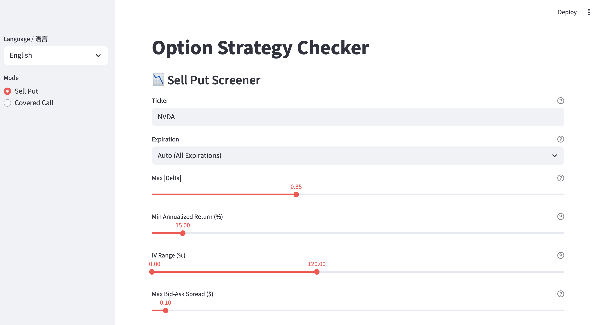

# sellput-checker

# 🚀 Sell Put Checker

An interactive tool for **Options Sellers** to analyze **Sell Put strategies** with automatic filters like IV, Delta, Bid/Ask Spread, and Annualized Returns.  
Stop manually calculating option greeks — let the checker show you **the best put opportunities instantly**.  

一个专为**期权卖方**打造的交互式工具，用于分析 **卖出看跌期权策略**。

自动计算 **隐含波动率、Delta、买卖差价、年化收益率**，帮你快速找到最优的期权机会！




## ✨ Features 功能亮点
- 📈 Real-time option chain analysis   实时期权链分析
- ⚡ Delta, Implied Volatility (IV), ITM Probability, Assignment Probability  自动获取 Delta、隐含波动率 (IV)、价内概率、行权估计概率
- 🎯 Annualized % return calculation for better decision making   年化收益率计算，帮你快速对比不同合约
- Bilingual 支持中英双语

## 🛠️ Usage 使用说明
```bash
git clone https://github.com/yourname/sellput-checker.git
cd sellput-checker
pip install -r requirements.txt
 ./run.sh
```


---

Made with ❤ for option sellers.
